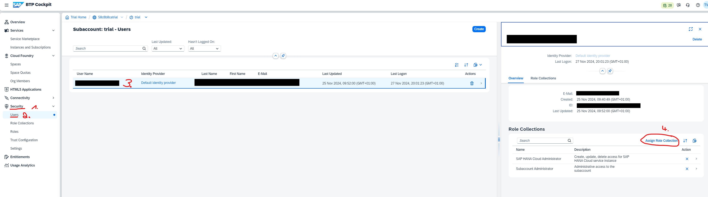
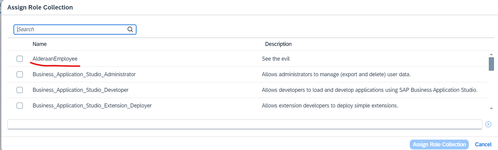

# Running the Hardware Store

<!--toc:start-->

- [Running the ERP system](#running-the-erp-system)
  - [Prerequisites](#prerequisites)
  - [Running the ERP locally](#running-the-erp-locally)
    - [Installing the SAP CAP](#installing-the-sap-cap)
    - [Clone and run the simple ERP system](#clone-and-run-the-simple-erp-system)
  - [Deploy the system to SAP BTP](#deploy-the-system-to-sap-btp)
    - [Set Up SAP BTP Trial Account](#set-up-sap-btp-trial-account)
    - [Set Up SAP Business Application Studio](#set-up-sap-business-application-studio)
    - [Cloning the project and installing dependencies](#cloning-the-project-and-installing-dependencies)
    - [Preparing the SAP BTP trial account](#preparing-the-sap-btp-trial-account)
    - [Packaging and deploying the Mini-ERP system](#packaging-and-deploying-the-mini-erp-system)
    - [Assigning necessary roles](#assigning-necessary-roles)
  - [SAP CAP resources](#sap-cap-resources)
    - [Tutorials](#tutorials)
  - [Navigation](#navigation)
  <!--toc:end-->

In this lab, you will install and run a small hardware shop built using SAP BTP (Business Technology Platform. By the end of this exercise, you should have the system running in SAP BTP, with a basic understanding of how it operates.

This hardware shop will be used throughout the lecture as a basis for
additional exercises.

## Prerequisites

- A laptop or desktop computer with internet access and
- A email address and a phone number
- Basic knowledge of the terminal
- Basic knowledge of Git Node.js and SAP BTP


## Deploy the hardware shop in SAP BTP

The deployment of the hardware shop is described using the [SAP Business Application
Studio](https://www.sap.com/products/technology-platform/business-application-studio.html).
It would also be possible to deploy from your computer. However, using the SAP
Business Application Studio is recommended as it simplifies the deployment
process.

### Set Up SAP BTP Trial Account

1. Follow [this tutorial](https://developers.sap.com/tutorials/hcp-create-trial-account..html) to create a trial account for SAP BTP.

### Set Up SAP Business Application Studio

1. Follow [this tutorial (only Step 4 needed)](https://developers.sap.com/tutorials/set-up-bas..html#:~:text=STEP%204-,Launch%20SAP%20Business%20Application%20Studio,-Navigate%20to%20your) to subscribe to the SAP Business Application Studio in your trial account.
2. When creating the development workspace in the 4th step of the tutorial,
   name the development workspace _Hardware_Store_.

### Cloning the project and installing dependencies

1. Open the development workspace you created in the previous step.
1. Open the _Source Control_ perspective and click on **Clone Repository**.
   Provide the URL of this repository (`https://github.com/WebThor/btp_app.git`)and clone it into the projects folder
   (`/home/user/projects/`). Select to open the repository.
1. Open a terminal by right-clicking on the `myapp` folder and selection _Open in
   Integrated Terminal_.
 
   
### Setup Cloud Foundry

1. In the newly opened terminal, run `cf login -a https://api.cf.us10-001.hana.ondemand.com`
	a. The terminal will ask you for an **email address**. Enter the one with which you registered at SAP BTP (for SAP Employees, this is you @sap.com email address)
	b. The terminal asks you for a password. This is the password you use to sign-in into your SAP account (for SAP Employes, this is your windows password)

The result should look like this:

   ```bash
   Authenticating...
OK

Targeted org XXXtrial.

Targeted space dev.

API endpoint:   https://api.cf.us10-001.hana.ondemand.com
API version:    3.180.0
user:           <your email address>
org:            XXXtrial
space:          dev
   ```
   
### Deploy the XSUAA Service

We need to provide an SAP Authorization and Trust Management Service (XSUAA) to ensure that we can log in to the hardware store and get authenticated by SAP BTP. 

The [XSUAA](https://learning.sap.com/learning-journeys/discover-sap-business-technology-platform/illustrating-sap-authorization-and-trust-management-service-xsuaa-_b9fde282-4cff-4dca-b146-7c8f8dde9955) service within SAP BTP manages the authorization flow among users, identity providers, and applications/services. It is an SAP-developed component tailored for SAP BTP, built upon the Cloud Foundry's open-source UAA, an OAuth provider handling authentication and authorization. XSUAA extends UAA with SAP-specific features and is essential for granting business users permissions through roles within SAP BTP, Cloud Foundry.

XSUAA does not store user data but requires a trusted connection to an identity provider, such as the SAP ID Service (which is the Provider used in the BTP Trail environment) or another integrated corporate identity provider, facilitated through SAP Cloud Identity Services—Identity Authentication Service (IAS). It serves as the central infrastructure for business user authentication and authorization in SAP BTP’s Cloud Foundry environment, enriched with a service broker, multi-tenancy, management APIs, and minor enhancements by SAP.

Using OAuth, XSUAA authenticates between services and connects to the identity provider. OAuth is an open standard for managing authorization without sharing passwords, using tokens to authenticate identities. These tokens, called JWT (JSON Web Tokens), securely transmit information between parties, ensuring safe authentication and access rights management within the OAuth framework.

#### XSUAA Configuration

The SAP XSUAA (SAP Authorization and Trust Management Service) configuration is a crucial component for managing user authorization and access control within any SAP application. This configuration is typically defined in a `xs-security.json` file and includes various elements that outline permissions and roles necessary for the secure and efficient operation of the application. In ower hardware store, the configuration file can be found at `myapp/security/xs-security.json`


##### Key Components of XSUAA Configuration
Details about the components can be found [here](https://help.sap.com/docs/btp/sap-business-technology-platform/application-security-descriptor-configuration-syntax)

##### The XSUAA configuration of the Hardware Store

```bash
{
	"xsappname": "product-list",
	"tenant-mode": "dedicated",
	"scopes": [
	  {
		"name": "$XSAPPNAME.read",
		"description": "With this scope, USER can read products."
	  },
	  {
		"name": "$XSAPPNAME.edit",
		"description": "With this scope, USER can edit the website."
	  },
	  {
		"name": "$XSAPPNAME.admin",
		"description": "With this scope, ADMIN can manage the application."
	  },
	  {
		"name": "$XSAPPNAME.guest",
		"description": "With this scope, GUEST can view public data."
	  }
	],
	"role-templates": [
	  {
		"name": "Viewer",
		"description": "Role to get the list of products",
		"scope-references": [
		  "$XSAPPNAME.read"
		]
	  },
	  {
		"name": "Editor",
		"description": "Role to edit the website",
		"scope-references": [
		  "$XSAPPNAME.edit"
		]
	  },
	  {
		"name": "DeathStar",
		"description": "Be the eval :-)",
		"scope-references": [
		  "$XSAPPNAME.read",
		  "$XSAPPNAME.edit",
		  "$XSAPPNAME.admin"
		]
	  },
	  {
		"name": "Alderaan",
		"description": "Role for only viewing the evil",
		"scope-references": [
		  "$XSAPPNAME.guest"
		]
	  }
	],
	"role-collections": [
	  {
		"name": "ProductListViewer",
		"description": "Product List Viewer",
		"role-template-references": [
		  "$XSAPPNAME.Viewer"
		]
	  },
	  {
		"name": "ProductListEditor",
		"description": "Product List Editor",
		"role-template-references": [
		  "$XSAPPNAME.Editor"
		]
	  },
	  {
		"name": "Imperator",
		"description": "Product List imperator",
		"role-template-references": [
		  "$XSAPPNAME.DeathStar"
		]
	  },
	  {
		"name": "AlderaanEmployee",
		"description": "See the evil",
		"role-template-references": [
		  "$XSAPPNAME.Alderaan"
		]
	  }
	],
  "oauth2-configuration": 
    {  
      "redirect-uris": ["https://*.cfapps.us10-001.hana.ondemand.com/**"]       
      }
}
```

##### The XSUAA configuration of the Hardware Store explained

- **xsappname**: The unique name of the application, which is "product-list".
- **tenant-mode**: Indicates how the application handles tenants. In this case, it is set to "dedicated", meaning each tenant has its own dedicated instance.

##### Scopes

Scopes define specific permissions within the application. These are used to restrict user actions.

- **$XSAPPNAME.read**: Allows the user to read products.
- **$XSAPPNAME.edit**: Allows the user to edit the website.
- **$XSAPPNAME.admin**: Allows the admin to manage the application.
- **$XSAPPNAME.guest**: Allows the guest to view public data.

##### Role Templates

Role templates combine individual scopes into roles that can be assigned to users.

- **Viewer**:
  - Description: Role to get the list of products.
  - Scope Reference: `$XSAPPNAME.read`

- **Editor**:
  - Description: Role to edit the website.
  - Scope Reference: `$XSAPPNAME.edit`

- **DeathStar**:
  - Description: Be the evil :-).
  - Scope References: `$XSAPPNAME.read`, `$XSAPPNAME.edit`, `$XSAPPNAME.admin`

- **Alderaan**:
  - Description: Role for only viewing the evil.
  - Scope Reference: `$XSAPPNAME.guest`

##### Role Collections

Role collections group role templates that can be assigned to users for easier management.

- **ProductListViewer**:
  - Description: Product List Viewer.
  - Role Template Reference: `$XSAPPNAME.Viewer`

- **ProductListEditor**:
  - Description: Product List Editor.
  - Role Template Reference: `$XSAPPNAME.Editor`

- **Imperator**:
  - Description: Product List imperator.
  - Role Template Reference: `$XSAPPNAME.DeathStar`

- **AlderaanEmployee**:
  - Description: See the evil.
  - Role Template Reference: `$XSAPPNAME.Alderaan`

##### OAuth2 Configuration

The OAuth2 configuration specifies settings for OAuth2 authentication.

- **redirect-uris**: An array of redirect URIs allowed for OAuth2 authentication. In this case, the wildcard pattern allows any subdomain of `cfapps.us10-001.hana.ondemand.com`:

  - `"https://*.cfapps.us10-001.hana.ondemand.com/**"`

##### Example User Flow

1. **Viewer Role**:
   - A user assigned the "ProductListViewer" role collection will inherit the permissions from the "Viewer" role template, allowing them to read products through the scope `$XSAPPNAME.read`.

2. **Editor Role**:
   - A user assigned the "ProductListEditor" role collection will inherit permissions from the "Editor" role template, allowing them to edit the website through the scope `$XSAPPNAME.edit`.

3. **Imperator Role**:
   - A user assigned the "Imperator" role collection will inherit permissions from the "DeathStar" role template, allowing them to read, edit, and manage the application through the scopes `$XSAPPNAME.read`, `$XSAPPNAME.edit`, and `$XSAPPNAME.admin`.

4. **Alderaan Employee Role**:
   - A user assigned the "AlderaanEmployee" role collection will inherit permissions from the "Alderaan" role template, allowing them to view public data through the scope `$XSAPPNAME.guest`.

This configuration allows for a granular and organized approach to managing user roles and permissions within the "product-list" application.


### Assigning necessary roles

To complete the deployment a user must be assigned to a role collection defined in the BTP XSUAA configuration. A user for example needs to get the "Alderaan Employee" role.

1.  Open the  SAP BTP  cockpit.
2.  Go to the BTP Subaccount "trial".
3. Choose  **Security** > **Role Collections**.
4. Select your user 
5. Choose /search for the  role collection "AlderaanEmployee"
6. Assign this role collection to your user

   
   

CONGRATULATIONS! Your user has now the role collection of an Alderaan Employee and can access the hardware store. To do so, visit this website: `https://frontendGroupxx.cfapps.us10-001.hana.ondemand.com`


## SAP CAP resources

- [SAP CAP documentation](https://cap.cloud.sap/)

### Tutorials


## Navigation

🏠 [Overview](../README.md) 


5. cf create-service xsuaa application xsuaa-service-tutorial -c ./security/xs-security.json

6. Run cf service xsuaa-service-tutorial till status = "create succeeded"

6. Update manifest.yml pro Gruppe. Ersetze hierbei xx durch jeweilige Gruppe

7. cf push

10. if both apps are in the start:running, go to https://frontendgroupxx.cfapps.us10-001.hana.ondemand.com/products (xx is your group name)

11. Go into the folder: ./myapp/security and open the xs-security.json file

12. Update XSUAA cf update-service  xsuaa-service-tutorial -c ./security/xs-security.json
